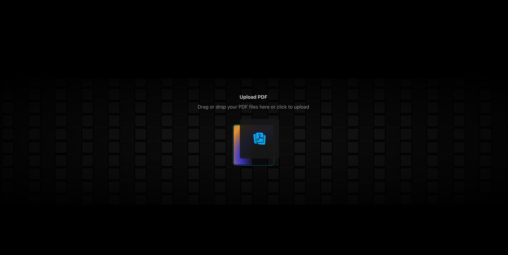

# Next.js PDF Review & Versioning – Frontend Assignment

**A frontend-only Next.js application for uploading, editing, versioning, and exporting PDFs with annotations and version history.**  
Built with Next.js, it allows users to manage PDFs entirely in the browser, track version history, and generate annotated exports.



## Table of Contents

1. [Project Overview](#project-overview)
2. [Features](#features)
3. [Tech Stack](#tech-stack)
4. [Setup & Installation](#setup--installation)
5. [How to Use](#how-to-use)
6. [Implementation Details](#implementation-details)
   - [PDF Upload & Initialization](#pdf-upload--initialization)
   - [Viewing & Navigation](#viewing--navigation)
   - [Editing Content & Annotations](#editing-content--annotations)
   - [Versioning & Diffing](#versioning--diffing)
   - [Exporting Annotated PDFs](#exporting-annotated-pdfs)
   - **[Service Architecture & Future Features](#service-architecture--future-features)**
7. [Challenges & Trade-offs](#challenges--trade-offs)
8. [References / Libraries Used](#references--libraries-used)

## Project Overview

This project is a frontend PDF management tool built with Next.js. It allows users to upload PDFs, view pages with thumbnails, add annotations like highlights or sticky notes, and track version history. Users can commit new versions with messages and compare changes between versions.
The app is fully browser-based, storing files and metadata in IndexedDB, and uses @react-pdf-viewer and pdf-lib for PDF rendering and manipulation.

## Features

- ✅ **Upload & Initialize PDFs**
  - Drag & drop or select a PDF file to upload.
  - Automatic creation of Version 1 (V1) with file validation and friendly error states.
  - Persists file and V1 metadata in IndexedDB via Dexie.js.

- ✅ **View & Navigate PDFs**
  - Page thumbnails, zoom, pan, and jump-to-page functionality.
  - Text selection and search within the document.

- ✅ **Edit Content & Add Annotations**
  - Highlights, sticky notes, free text boxes, and rectangle redactions.
  - Edits are tracked as content operations; annotations remain non-destructive until committed.

- ✅ **Versioning & History**
  - Commit new versions (V2, V3…) with version messages.
  - Track changes and view version history.

### Future Implementations / Stretch Goals

- **Editing Content:** Edit existing text while preserving font and layout.
- **Version History & Diffing:** Compare two versions with inline text and annotation diffs.
- **Export Annotated PDF:** Generate PDF with change log and inline callouts for all edits.
- **Optional / Stretch Goals:**
  - Real-time collaboration (CRDTs / Y.js)
  - Portable version bundles (export/import JSON)
  - PDF-to-PPT export

## Tech Stack

| Category            | Technology           | Purpose                                                                      |
| ------------------- | -------------------- | ---------------------------------------------------------------------------- |
| Framework           | ✅ Next.js 14+       | Core application framework.                                                  |
| PDF Handling        | ✅ @react-pdf-viewer | PDF rendering and UI/UX (viewer, toolbar, thumbnails).                       |
| PDF Manipulation    | ✅ pdf-lib           | Generating, modifying, and exporting PDFs programmatically.                  |
| State Management    | ✅ zustand           | Managing global application state and version history.                       |
| Client-Side Storage | ✅ dexie             | A wrapper for IndexedDB to persist large PDF files and metadata efficiently. |
| Styling             | ✅ TailwindCSS       | Rapid UI development and styling.                                            |
| Diffing             | ❌ diff-match-patch  | (Planned for text diff calculation).                                         |

## Setup & Installation

```bash
# Clone the repo
git clone https://github.com/bgskinner3/nextjs-pdf-versioning.git
cd nextjs-pdf-versioning

# Install dependencies
npm install

# Run locally
npm run dev

```

## How to Use

- 📤 **Upload:** Drag and drop a PDF file onto the designated area or use the file picker button. Version 1 (V1) is created automatically upon upload.
- 📖 **Navigate:** Use the thumbnail sidebar or toolbar buttons to move between pages, zoom in/out, and jump to specific pages.
- ✏️ **Annotate:** Select annotation tools (highlight, sticky note, free text, redaction) from the toolbar and interact with the main document viewer.
- 💾 **Commit Version:** Click "Commit Version" in the sidebar, add a descriptive message, and snapshot your changes as a new version (V2, V3…).
- 📊 **View History & Diff:** Select two versions from the history list to view a summary of text and annotation differences.

## Implementation Details

### I. PDF Upload & Initialization

- Users can drag & drop or pick a PDF file to upload.
- On first upload, Version 1 (V1) is automatically created.
- Zustand store keeps track of:
  - Current file
  - Document ID
  - Current version metadata
  - Annotations & content operations

Dexie (IndexedDB) persists the file and version metadata to allow offline usage and browser refresh without losing progress.

Error handling includes file type and size validation with user-friendly messages.

Key takeaway:
Zustand handles UI state, Dexie handles persistence—so the app is reactive and resilient even offline.

### II. Viewing & Navigation

- React-PDF-Viewer displays pages and provides:
  - Thumbnail sidebar
  - Zoom / pan functionality
  - Page navigation
  - Text selection & search

Key take away:
Viewing is fully interactive and non-destructive, allowing safe annotation and edits before committing.”

### III. Editing Content & Annotations

- Users can add:
- Highlights
- Sticky notes
- Free text boxes
- Rectangle redactions (mask layer)
- All edits tracked as content operations in Zustand.
- HighlighterStore persists annotations to localStorage to survive browser refresh.
- Editing text itself is non-destructive at this stage; PdfLibService would apply these edits when committing a version.

Key takeaway
Phase 3 is all about non-destructive edits—this prevents accidental changes while letting users interact freely with the document.

### IV. Versioning & Diffing

- Users can commit a new version with a message (e.g., “Updated figure caption on page 3”).
- Version metadata, content operations, and annotations are persisted in Dexie.
- Planned diffing would use:
  - Text extraction + diff-match-patch for inline changes
  - Annotation comparison to highlight added/removed/modified annotations

Key takeaway:
Even if diffing isn’t fully implemented, the data structures support it and the commit workflow ensures every version is reproducible

### Exporting Annotated PDFs

- PdfLibService is designed to:
  - Load the original PDF
  - Apply content operations + annotations
  - Generate a new PDF blob for download

- Exported PDFs can include:
  - Change log page
  - Inline callouts referencing version history

- Implementation planned; service structure fully supports it.

Key takeaway:
PdfLibService bridges non-destructive edits to permanent committed PDFs

## References / Libraries Used

1.  **ts-kit**
    - [GitHub Repository](https://github.com/bgskinner3/ts-kit)
    - A personal TypeScript utility library used for foundational helper functions such as state management abstractions and initial PDF text coordinate extraction logic. All core project logic and UI implementations were developed independently within this repository.

2.  **UI Implementations**
    - [Storybook Demo](http://storybook.masterofsum.dev/)
    - A repository of reusable, tested UI components used to speed up development of common elements like buttons, modals, and input fields.

3.  **PDF Manipulation Library Setup**
    - This project leverages the open-source library [pdf-lib](pdf-lib.js.org) for programmatic PDF modification and generation. No commercial SDK trial is required for this functionality.

---

## License

This project is licensed under the MIT License - see the [LICENSE.md](LICENSE.md) file for details.
